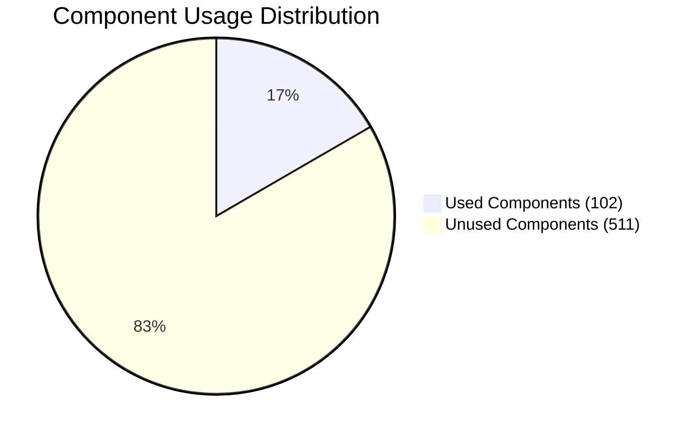
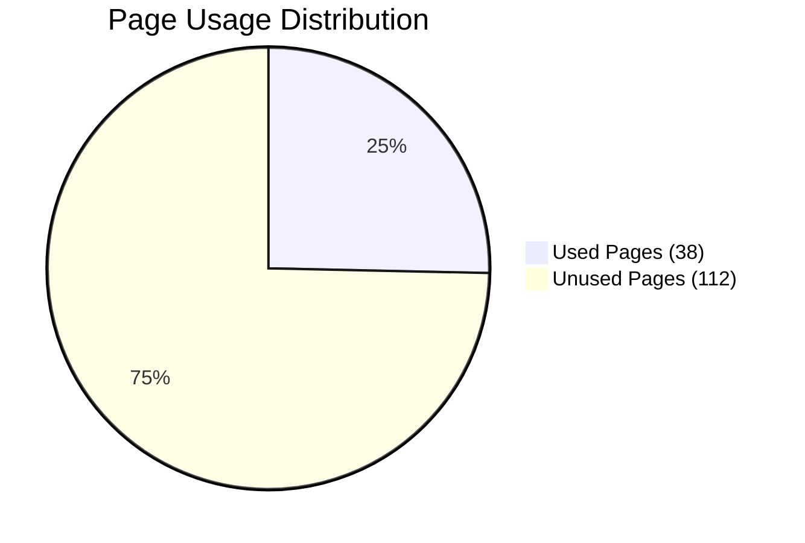
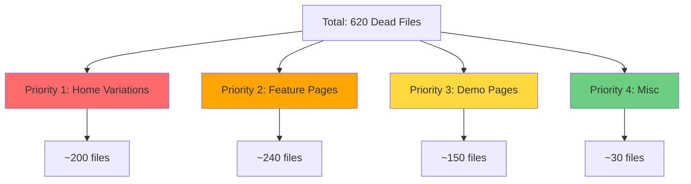
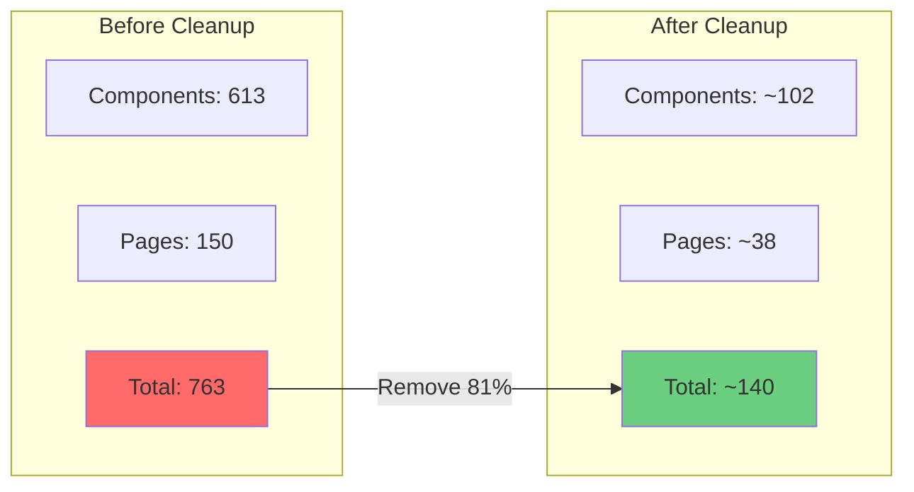
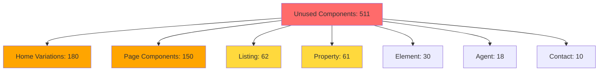
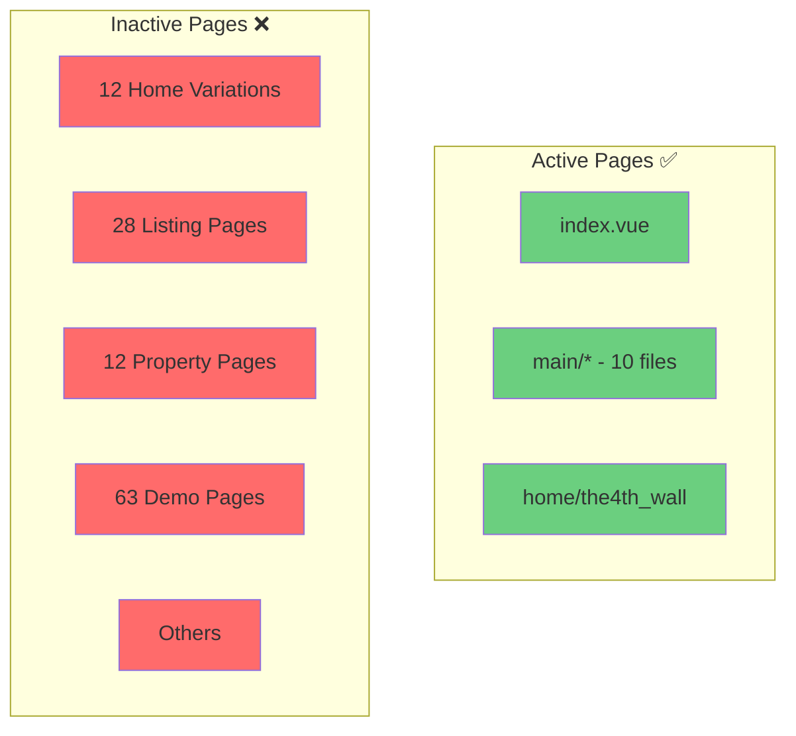
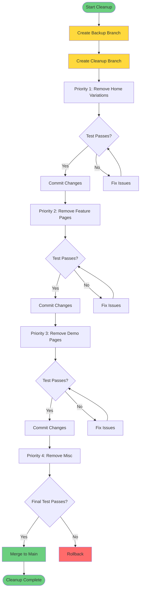
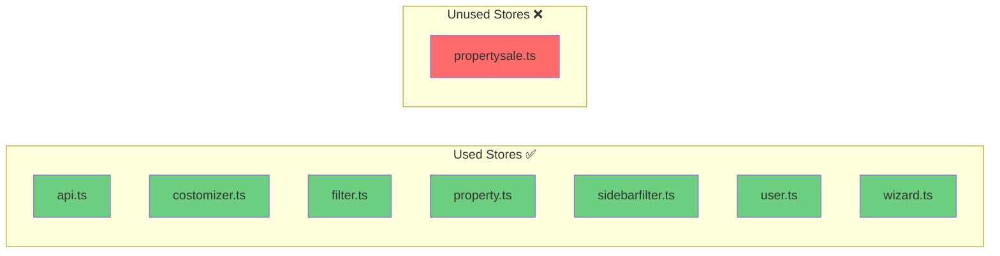
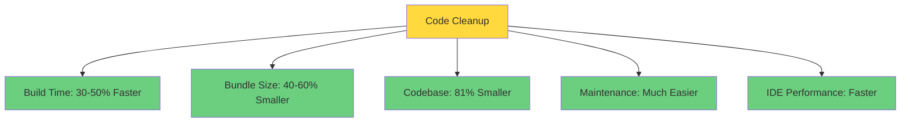
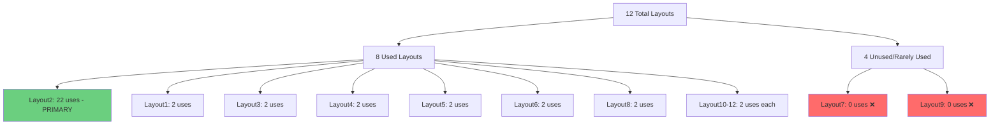

# Dead Code Visualization

## Component Usage Overview

## Page Usage Overview

## Cleanup Impact by Priority

## File Structure - Before vs After Cleanup

## Unused Components by Category

## Active vs Inactive Pages

## Cleanup Workflow

## Store Module Status

## Expected Benefits

## Layout Usage Distribution

